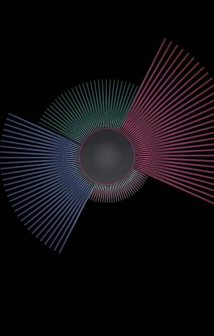

# Metal Audio Visualizer

Real-time, GPU-driven audio visualizer for iOS. It plays four isolated audio stems
in sync and renders each one as a living, reactive shape — a pulsing core disk with
120 rotating spikes that respond to the energy of every stem independently, at 60 FPS.

Built with **Swift**, **SwiftUI**, **Metal**, and **AVAudioEngine**.

<p align="center">
  
</p>

<p align="left">
  
  
  
  
</p>

---

## Overview

The app plays four pre-separated stems of a single track simultaneously and keeps them
sample-aligned. Each stem is metered on its own, and the four energy values drive a
single Metal shader that draws the whole scene on the GPU.

| Stem   | Role       | Color  |
| ------ | ---------- | ------ |
| 🎤 Vocals | mid energy | red    |
| 🥁 Drums  | transients | yellow |
| 🎸 Bass   | low end    | blue   |
| 🎹 Other  | harmony    | green  |

## Features

- **Four independent stems** played in perfect sync via a single `AVAudioEngine` graph.
- **Per-stem real-time analysis** — an RMS meter is tapped off each player node.
- **Fully GPU-driven rendering** — geometry and color are computed in a custom Metal
  vertex/fragment shader; the CPU only uploads four floats per frame.
- **Additive HDR blending** (`rgba16Float`) for a soft, glowing look.
- **60 FPS** rendering through `MTKView`.

## How it works

```
Audio Tracks (.m4a)                 GPU
 ┌───────────────┐    RMS tap   ┌──────────────────────────┐
 │ vocals        ├──────────────► vocalsLevel              │
 │ drums         ├──────────────► drumsLevel   ── Uniforms ─► Shaders.metal
 │ bass          ├──────────────► bassLevel                │   • disk (core)
 │ other         ├──────────────► otherLevel               │   • 120 spikes
 └──────┬────────┘              └──────────────────────────┘
        │                                    │
  AVAudioEngine  ─── mainMixerNode ──► speakers        MTKView @ 60 FPS
```

1. **`AudioAnalyzer`** attaches four `AVAudioPlayerNode`s to one `AVAudioEngine`,
   schedules all files, and starts them at a shared host time so the stems stay locked
   together. Each node installs a tap that computes an RMS level per buffer.
2. **`Renderer`** builds the disk and spike geometry once, then every frame packs the
   four stem levels (plus elapsed time) into a `Uniforms` struct and issues two draw
   calls.
3. **`Shaders.metal`** turns each stem's level into spike length and color, rotates the
   ring over time, and adds a soft radial glow scaled by overall loudness.

## Tech stack

| Layer         | Technology                          |
| ------------- | ----------------------------------- |
| UI            | SwiftUI (`UIViewRepresentable`)     |
| Audio         | AVAudioEngine, AVAudioPlayerNode    |
| Rendering     | Metal, MetalKit (`MTKView`)         |
| Shading       | Metal Shading Language              |
| Language      | Swift 5                             |

## Getting started

**Requirements:** Xcode 15+, iOS 15+ device or simulator.

```bash
git clone https://github.com/nevzorov46/MetalAudioVisualizer.git
cd MetalAudioVisualizer
open MetalAudioVisualizer.xcodeproj
```

Select an iOS Simulator (or a device) and press **Run** (⌘R). The four stems in
`MetalAudioVisualizer/Audio Tracks/` load automatically on launch.

To visualize your own track, split it into `vocals.m4a`, `drums.m4a`, `bass.m4a`, and
`other.m4a` (any stem separator works) and drop them into the `Audio Tracks` folder.

## Project structure

```
MetalAudioVisualizer/
├── Meta_AudioApp.swift     App entry point
├── ContentView.swift       Root SwiftUI view
├── MetalView.swift         SwiftUI ↔ MTKView bridge
├── Renderer.swift          Metal pipeline, geometry, per-frame draw
├── Shaders.metal           Vertex + fragment shaders
├── AudioAnalyzer.swift     AVAudioEngine graph + per-stem RMS taps
├── Constants.swift         Tunable parameters
└── Audio Tracks/           Sample stems (.m4a)
```

## Roadmap

- [ ] Live microphone / system-audio input
- [ ] Selectable tracks from the Files app
- [ ] FFT-based frequency bands in place of a single RMS value
- [ ] User-configurable color themes

## License

Released under the [MIT License](LICENSE).

## Author

**Valery Nevzorov** — [GitHub](https://github.com/nevzorov46)
